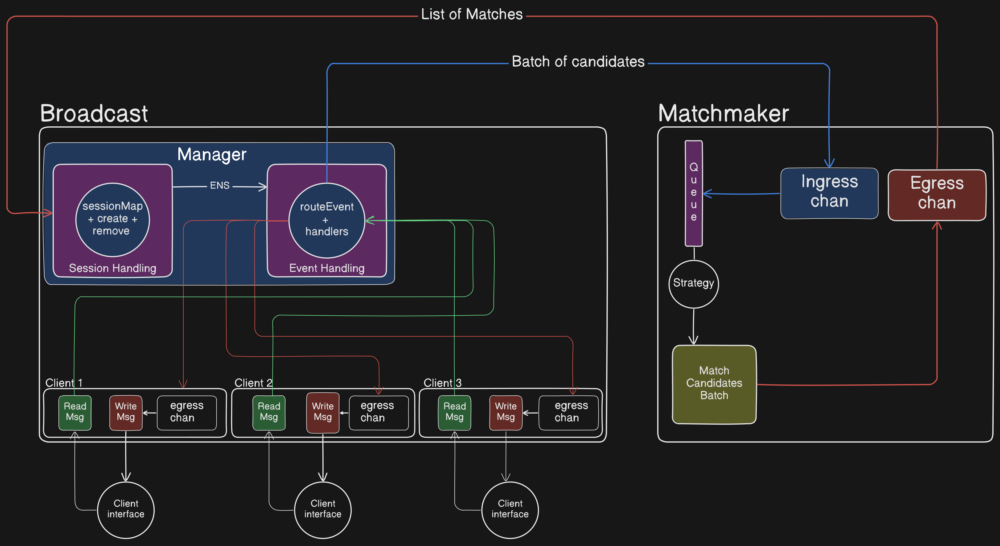

# hi-five

A chat application that matchs based on common interests

## Data Flow

## Broadcast

Facilitates flow of events between clients and the server

 - readMessages: listens to incoming messages from the client and sends them to routeEvent to assign the event to a handler
 - writeMessages: sends a message to a particular client upon recieving an event in that client's egress channel
 - parsePayload: parses the incoming payloads by asserting a type based on the event type
 - setupEventHandlers: configures all event handlers when a new Connection Manager is created
 - addClient: adds a client to the Client set of the Connection Manager
 - removeClient: removes a client for the Client set
 - routeEvent: routes event to appropraite handler
 - ServerConnections: http handler that creates a new socket connection and starts readMessages, writeMessages
 - Debug: http handler to query Connection manager status during development

